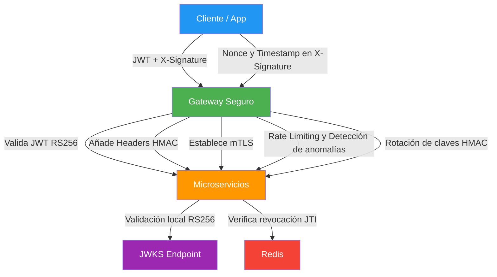

# 📘 Arquitectura Propuesta – Diseño, Análisis y Diagrama

## ✅ Descripción General
Esta arquitectura está diseñada para entornos **multi-microservicio** con altos requerimientos de seguridad y escalabilidad. Combina estándares probados (OAuth2/OIDC, JWT RS256) con mecanismos avanzados de protección (mTLS, firmas HMAC, X-Signature estilo TikTok).

---

## 🔐 Componentes Principales y Funcionalidad

### 1. **Base: JWT + JWKS + RS256**
- **Qué es:**  
  Uso de **JSON Web Tokens (JWT)** firmados con algoritmo asimétrico **RS256**.
- **Cómo funciona:**  
  - El servicio de autenticación firma tokens con clave privada.
  - Microservicios validan tokens localmente usando claves públicas obtenidas desde un **JWKS endpoint** (`/.well-known/jwks.json`).
- **Beneficios:**  
  - Seguridad alta (no hay secreto compartido).
  - Validación local → baja latencia.
  - Compatible con Auth0, Firebase, Keycloak.
- **Tokens cortos:**  
  Duración 5–15 min para reducir impacto de compromisos.
- **Revocación:**  
  Redis almacena lista de JTI para invalidar tokens en logout o compromiso.

---

### 2. **Gateway Seguro (Opcional)**
- **Qué es:**  
  Un punto de entrada central que filtra y valida tráfico antes de llegar a los microservicios.
- **Funciones:**  
  - Valida JWT antes de enrutar.
  - Añade **headers HMAC** para integridad.
  - Establece **mTLS** con microservicios.
  - Aplica **rate limiting** y detección de anomalías.
- **Beneficio:**  
  Defensa en profundidad y control centralizado.

---

### 3. **Firma Criptográfica estilo TikTok (X-Signature)**
- **Qué es:**  
  Cada cliente genera un header `X-Signature` usando HMAC:
  ```
  HMAC(secret, method + path + timestamp + body)
  ```
- **Propósito:**  
  - Garantiza integridad del request.
  - Protege contra replay attacks (usa nonce + timestamp).
  - Similar a AWS Signature v4 y Azure HMAC.

---

### 4. **Protecciones Adicionales**
- **Nonce + Timestamp:**  
  Evita reutilización de peticiones.
- **Rotación de claves HMAC:**  
  Multi-key support para evitar interrupciones.
- **Rate limiting:**  
  Previene abuso y ataques DoS.

---

## ⚙️ Implementación Recomendada (Fases)
1. **Semana 1-2:** Migrar a JWT RS256 + JWKS.
2. **Semana 3:** Implementar Redis para revocación.
3. **Semana 4-5:** Añadir Gateway + mTLS.
4. **Semana 6:** Incorporar X-Signature para APIs públicas.

---

## ✅ Impactos Positivos
- Seguridad **enterprise-grade**.
- Escalabilidad por validación local.
- Integridad y protección contra replay.
- Compatible con estándares.

## ⚠️ Impactos Negativos
- Complejidad media-alta (10-15 días).
- Latencia adicional (~10-20 ms por request).
- Nuevos puntos de falla (Gateway, Redis, JWKS).

---

## 🔍 Comparación con Arquitectura Actual
| Aspecto        | Actual (HS256) | Propuesta RS256 | Propuesta Completa |
|---------------|---------------|-----------------|---------------------|
| Seguridad     | Media         | Alta           | Muy alta |
| Complejidad   | Baja          | Media          | Alta |
| Latencia      | ~1 ms         | ~2-3 ms        | ~15 ms |
| Throughput    | ~10k RPS      | ~8k RPS        | ~5-7k RPS |

---

## 🖥️ Diagrama Arquitectónico (Mermaid)



---

## 📝 Opinión Técnica
- **Seguridad:** Nivel fintech/enterprise.
- **Complejidad:** Alta, pero escalable.
- **Eficiencia:** Latencia aceptable para APIs estándar.
- **Ideal para:** Fintech, salud, e-commerce grande.

